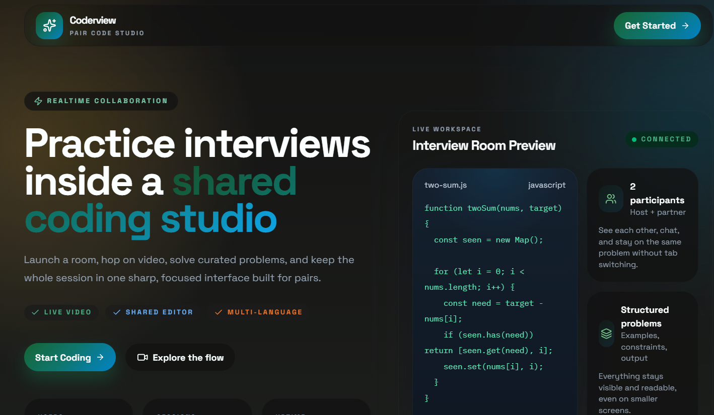

# Coderview

Coderview is a full-stack collaborative coding interview platform for practicing technical interviews in real time. It combines live video, chat, a Monaco-based code editor, curated DSA problems, and remote code execution so two users can solve problems together in a shared session.



## Features

- Clerk authentication for sign up and sign in
- Dashboard with active sessions and recent completed sessions
- Create or join 1:1 interview rooms
- Stream-powered video calling and in-session chat
- Monaco editor with support for JavaScript, Python, Java, and C++
- Curated problem library with starter code and expected outputs
- Code execution through OneCompiler
- MongoDB persistence for users and sessions
- Inngest functions for syncing Clerk users into MongoDB and Stream

## Tech Stack

### Frontend

- React 19
- Vite
- React Router
- TanStack Query
- Tailwind CSS v4 + DaisyUI
- Clerk
- Monaco Editor
- Stream Video + Stream Chat

### Backend

- Node.js
- Express
- MongoDB + Mongoose
- Clerk Express middleware
- Inngest
- Stream Node SDK

## Project Structure

```text
Coderview/
|-- backend/
|   |-- src/
|   |   |-- controllers/
|   |   |-- lib/
|   |   |-- middleware/
|   |   |-- models/
|   |   `-- routes/
|   `-- package.json
|-- frontend/
|   |-- public/
|   |-- src/
|   |   |-- api/
|   |   |-- components/
|   |   |-- data/
|   |   |-- hooks/
|   |   |-- lib/
|   |   `-- pages/
|   `-- package.json
`-- package.json
```

## How It Works

1. Users authenticate with Clerk.
2. Clerk user lifecycle events are handled by Inngest to create or delete matching MongoDB and Stream users.
3. A signed-in user can create a session by choosing a problem and difficulty.
4. The backend creates:
   - a MongoDB session record
   - a Stream video call
   - a Stream chat channel
5. Another user can join the active session and collaborate in real time.
6. Code is executed through the backend using the OneCompiler API.
7. When the host ends the room, the Stream call/channel are deleted and the session is marked as completed.

## Environment Variables

Create a `.env` file inside `backend/`:

```env
PORT=5000
NODE_ENV=development
CLIENT_URL=http://localhost:5173
DB_URL=your_mongodb_connection_string
INNGEST_EVENT_KEY=your_inngest_event_key
INNGEST_SIGNING_KEY=your_inngest_signing_key
STREAM_API_KEY=your_stream_api_key
STREAM_API_SECRET=your_stream_api_secret
ONECOMPILER_API_KEY=your_onecompiler_api_key
```

Create a `.env` file inside `frontend/`:

```env
VITE_API_URL=http://localhost:5000/api
VITE_CLERK_PUBLISHABLE_KEY=your_clerk_publishable_key
VITE_STREAM_API_KEY=your_stream_api_key
```

## Local Development

### 1. Install dependencies

From the repo root:

```bash
npm install
npm install --prefix backend
npm install --prefix frontend
```

### 2. Start the backend

```bash
cd backend
npm run dev
```

### 3. Start the frontend

In a second terminal:

```bash
cd frontend
npm run dev
```

### 4. Open the app

Visit `http://localhost:5173`

## Production Build

From the repo root:

```bash
npm run build
npm start
```

The root build script installs backend and frontend dependencies, then builds the Vite frontend. The backend serves the built frontend when `NODE_ENV=production`.

## API Overview

### Session routes

- `POST /api/sessions` create a session
- `GET /api/sessions/active` list active sessions
- `GET /api/sessions/my-recent` list recent completed sessions for the current user
- `GET /api/sessions/:id` get a session by id
- `POST /api/sessions/:id/join` join a session
- `POST /api/sessions/:id/end` end a session as host

### Chat route

- `GET /api/chat/token` generate a Stream token for the authenticated user

### Code execution route

- `POST /api/execute` run code against the OneCompiler API

### Health route

- `GET /health`

## Notes

- Authenticated routes depend on Clerk session cookies and backend `withCredentials` support.
- Stream video/chat requires both frontend and backend API keys to be configured.
- The Inngest endpoint is exposed at `/api/inngest`; Clerk events must be wired to it in your deployment setup.
- Current problem data is stored locally in `frontend/src/data/problems.js`.

## Scripts

### Root

- `npm run build`
- `npm start`

### Backend

- `npm run dev`
- `npm start`

### Frontend

- `npm run dev`
- `npm run build`
- `npm run preview`
- `npm run lint`

## Future Improvements

- Shared live code syncing between both participants
- Persistent submissions and session notes
- Better automated test-case evaluation per problem
- Session recordings and feedback summaries
- Search/filter support in the problem library

## License

ISC
